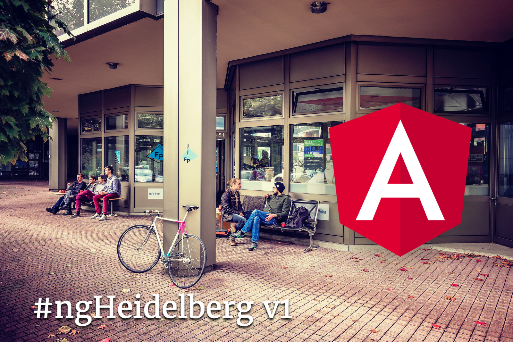

# #ngHeidelberg v1
_with Ferdinand Malcher_

For the first meetup, Angular book author and trainer Ferdinand Malcher from Leipzig will join us. He will discuss what makes Angular so great for all of us and go through the core concepts of the platform. We will also set up a fully-featured Angular app from scratch and see what’s in the box. You’re invited to join in and discuss what happens. What is your experience with Angular? We’d like to hear your story!

👨‍💻 [Slides](https://docs.google.com/presentation/d/1nhwVlGiv7Ygu8LT0eseCKq0Ii7ZlWPFf1NguVUKhXC0/)  
🚀 [Code](https://github.com/angular-schule/2018-07-meetup-heidelberg)  

