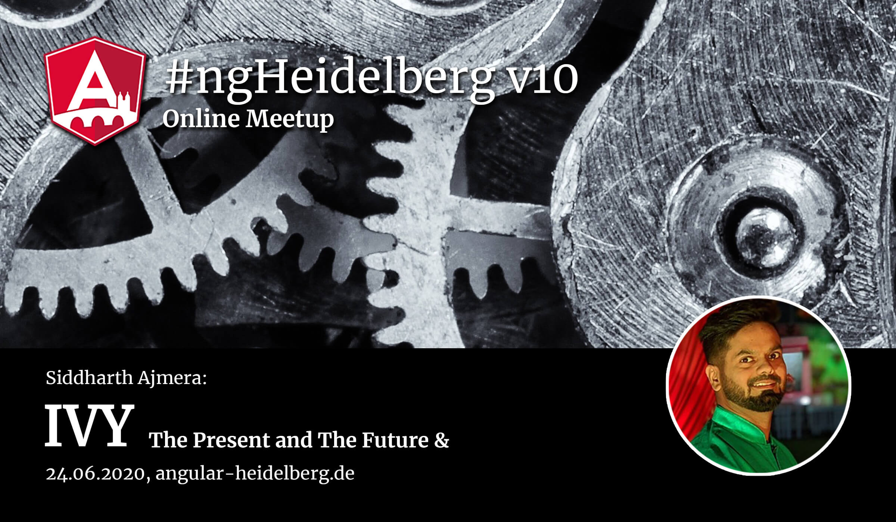

# #ngHeidelberg v10
_with Siddharth Ajmera & Alex Rickabaugh_

## Siddharth Ajmera: Ivy - The Present and The Future

This talk will introduce you to the new features that Ivy brings to Angular. We'll go through the Designs Goals of Ivy and you'll learn about a few new features that Ivy enables at present. The new possibilities on how to develop Angular Apps in the future.

A few features that you'll learn about are Dynamic Component Loading, the new debugging utility in Angular, etc. After that, you'll also learn what Angular will be able to offer in the near future. So we'll go through a few new API to render components with the Component Factory Resolver, load Angular Components without the need of an Angular Module, implement HoCs and perform Change Detection without using Zones. All these will be shown by examples.

After the talk, you will be well aware of these shiny new Angular features that you can and will be able to use in the near future.

The talk will be held in English.

## ABOUT SIDDHARTH AJMERA

Siddharth is a Google Developer Expert in Angular and Web Technologies currently based out in Sydney. As a Sr. Full Stack JavaScript Developer he works on Digital Transformation Engagements for his Organization.
Apart from his regular 9-5 Job, he is an Angular and Firebase instructor on Udemy, writes Articles and creates YouTube videos. You can find him almost anywhere on the Web with SiddAjmera.

📹 Video: https://youtu.be/JwMTJ5BCIKw  
💻 [Slides](https://docs.google.com/presentation/d/1rLko8imEjk0G1oScEEPC8mv9cP74iUB2sCCplBdfSpM/edit?usp=sharing)  
💻 [Slides Backup](slides-ivy-siddharth.pdf)  

-----

## Alex Rickabaugh: Stronger Type-Checking in Templates with Ivy

One of the new features in Angular Ivy is `strictTemplates`, a compiler flag that turns on much stronger validation and type-checking of component templates.

Discover how to use this new flag with Angular Framework team member Alex Rickabaugh. Learn how the new type-checking works, how best to migrate a large project onto stricter type-checking, and take a peek under the hood at how this feature works.

The talk will be held in English.

## ABOUT ALEX RICKABAUGH

Alex Rickabaugh is a software engineer at Google, and for the last three years has been a core member of the Angular team. Throughout his time on Angular, Alex has worked on the Service Worker implementation for Progressive Web Apps, server-side rendering support, and a rewrite of the HTTP API. Currently, he works on the Angular Compiler, getting it ready for the next generation architecture, Angular Ivy.

📹 Video: https://youtu.be/N8hIMDIG9B0  
💻 [Slides](https://docs.google.com/presentation/d/1lZ54ufZrB9p-k8BqYScTwbgDz7krXjvKNjKEQeQ0Hl0/edit?usp=sharing)  
💻 [Slides Backup](slides-ivy-alex.pdf)  
