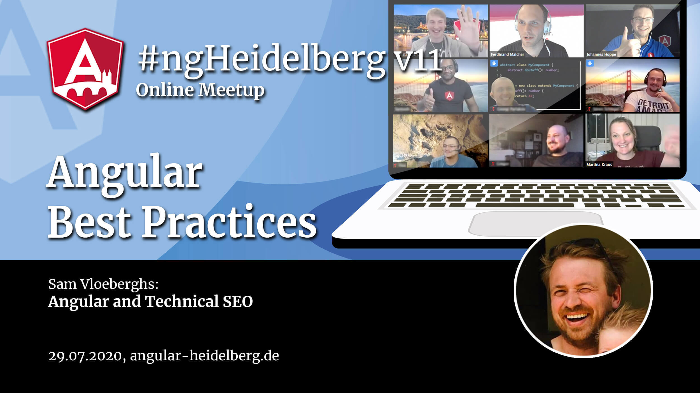

# #ngHeidelberg v11
_with Valentin Kononov and Sam Vloeberghs_

## Valentin Kononov: Bad Practices: What to avoid in Angular

Best practices… There are lots of best practices how you can make your app better. But at the end of the day we usually forget what we should NOT do in order to achieve better results. Let’s talk about some bad stuff like mis-using pipes, subscriptions, leaks, big lists, TS features and so on. This way we can finally get even closer to better and more performant apps in Angular.

The talk will be held in English.

## ABOUT VALENTIN KONONOV

Valentin works at Mapbox R&D center in Minsk, Belarus, experienced in .NET, Angular, React, React Native, NodeJS, NestJS and other interesting stuff in full stack software development. He loves modern web technical stack, but strongly believes in understanding of fundamental aspects of programming. He likes code writing, work in amazing and useful projects, which can bring something valuable to people.

📹 Video: TODO  
💻 [Slides](TODO)  

-----

## Sam Vloeberghs: Angular and Technical SEO

Handling proper SEO for Angular (and in general, JavaScript based) applications and websites has been a challenge in the past. But with Angular Universal and more recently Scully things have evolved in the right direction!
In this talk we will discuss several practical and technical techniques that will make your website SEO-proof for all Search Engines and social crawlers, even in a multi language setup, like;
- Server-side-rendering, Static Site Generation and prerendering
- Setting the title and meta tags
- Rendering JSON-LD
- Supporting multiple languages
- Localizing the application routes

The talk will be held in English.

## ABOUT SAM VLOEBERGHS

Sam is a freelance software architect and Internet entrepreneur, currently focusing on frontend technologies and frameworks like Angular and Workbox while keeping a sharp eye on the basics and advanced aspects of HTML5. He is the co-organiser of the Belgian Angular Conference, NG-BE and the Angular Belgium meetup. Sam writes about the technologies he uses on a daily basis at https://samvloeberghs.be .

📹 Video: TODO  
💻 [Slides](TODO)  
