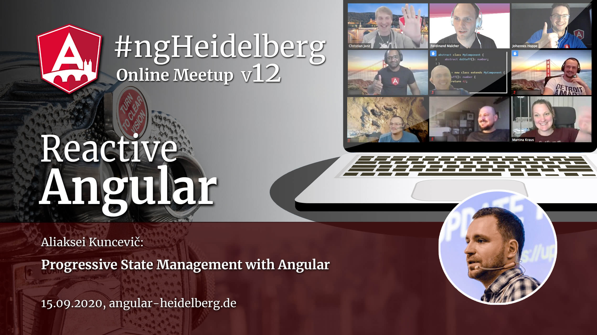
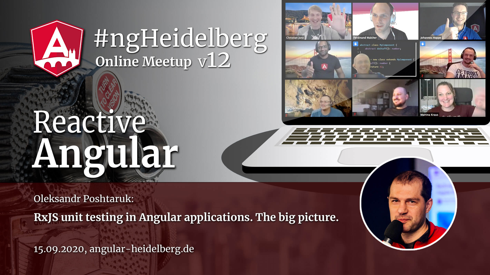

# #ngHeidelberg v12
_with Aliaksei Kuncevič & Oleksandr Poshtaruk_

## Aliaksei Kuncevič: Progressive State Management with Angular

This talk is about how to manage state of your Angular apps progressively starting by using Reactive Services approach and then switching to sophisticated state management solution. I will demonstrate how to power up the functionality of your app state using NGXS and NGXS plugins

The talk will be held in English.

## ABOUT ALIAKSEI KUNCEVIČ

Aliaksei is on a mission to teach people Angular and works works as an independent consultant. He is also organizing an Angular and frontend-related meetups and writes and speaks regularly on Angular-related topics. As a member of the NGXS core team, he is deeply familiar with the topic of state manament.

📹 Video: TODO  
💻 [Slides](TODO)  

-----

## Oleksandr Poshtaruk: RxJS unit testing in Angular applications. The big picture.

If you already tried to code unit tests for Observables - then you may be overwhelmed with a variety of methods on how to do that.
Which one is right for you?
What is common for them and where they differ? How to put all of them in one solid picture in your head?
This is what I am going to do in my talk - I will make you understand the system. The system of RxJS unit testing tools for Angular applications.

The talk will be held in English.

## ABOUT OLEKSANDR POSHTARUK

Oleksandr works as a senior front-end dev. In the last 4+ years he has been working in commercial projects heavily using the Angular framework and the RxJS library. Many will know him through his contributions to the "Angular-in-Depth" blog and his "Hands-on RxJS" and "RxJS unit testing" video-courses.

📹 Video: TODO  
💻 [Slides](TODO)  
