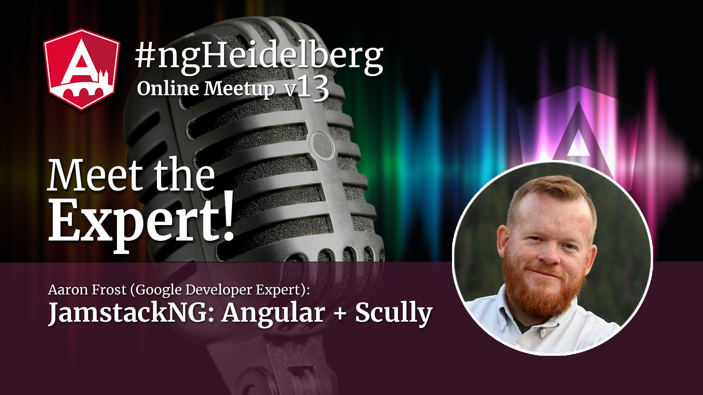
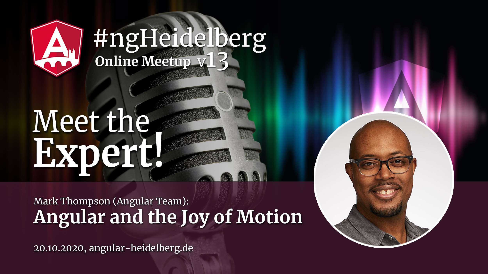

# #ngHeidelberg v13
_with Aaron Frost and Mark Thompson_

## Aaron Frost: JamstackNG: Angular + Scully

Nothing will make your Angular project as fast as embracing the Jamstack. In this presentation we will talk about how Scully helps you turn your Angular apps into Jamstack apps, and we will explain how easy it can be to use.

The talk will be held in English.

## ABOUT AARON FROST

Frosty is the CEO and co-founder of HeroDevs. He's also one of the lead organizers for ng-conf, the galaxy's largest Angular conference.
For the last five years, he's been a Google Developer Expert (GDE) for his work in the JavaScript community and for his deep knowledge around the Angular-of-things. He's as passionate about coding as he is about tacos. Where some people see a new sunrise, Frosty sees a chance to write more code and to meet new food.

📹 Video  
💻 Slides  

-----

## Mark Thompson: Angular and the Joy of Motion

Animation in apps can have a delightful impact on the user’s experience but adding animation can be a challenge. In this talk, we’ll have a look at Angular’s first class support for Animation and how you can use it to make your apps even more delightful for your users.

The talk will be held in English.

## ABOUT MARK THOMPSON

Mark loves to teach and code. His love for both of these disciplines has led to becoming an award winning university instructor and software engineer. He comes with a passion for creating meaningful learning experiences. With over a decade of developing solutions across the tech stack, Mark likes to use that experience to break down fear of technology and make challenging technical topics more accessible. Lately, Mark has been spending time as a Developer Advocate at Google.

📹 Video  
💻 Slides  