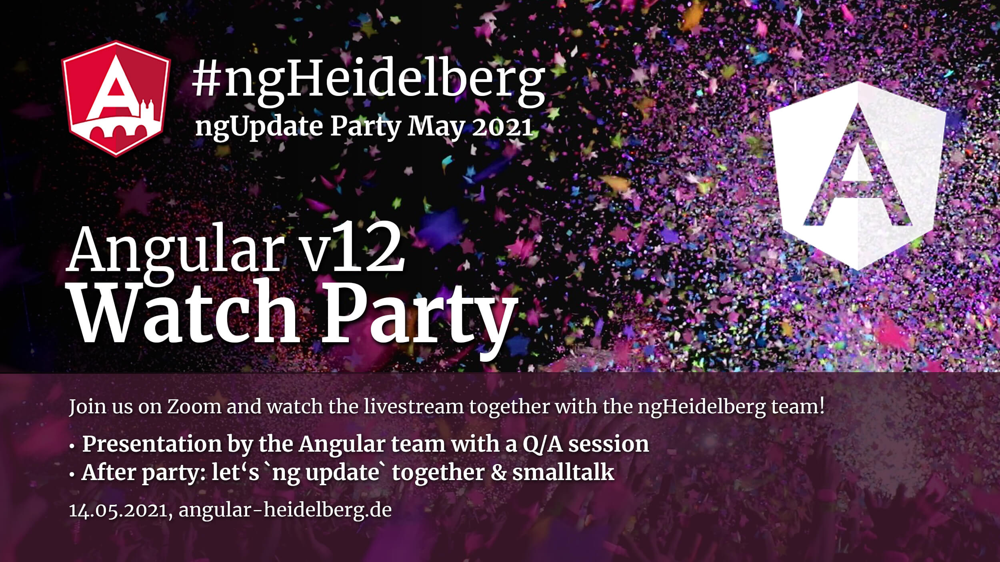

# #ngHeidelberg v14 – #ngUpdate Watch Party 🎉 May 2021

Angular 12 has just been released. Let's celebrate this milestone. The Angular team is throwing a party and we are all invited! 🎉🎉🎉

We're going to watch the livestream together and we're super excited to see all the cool new updates that the 🅰️Angular team has prepared. Afterwards we stay around in the zoom meeting and continue the party in a smaller group. If you like, you can try out `ng update` right away. The Heidelberg team will be happy to help.