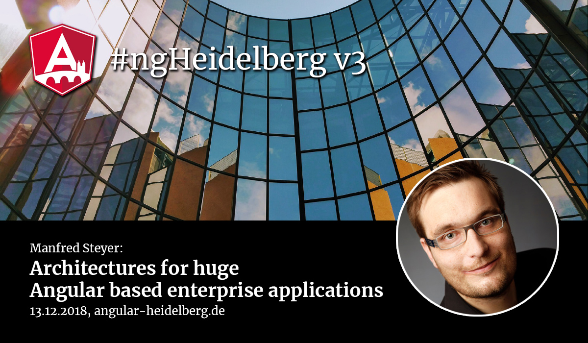

# #ngHeidelberg v3
_with Manfred Steyer_

## Architectures for huge Angular based enterprise applications: npm Packages, Monorepos and Micro Apps

Nowadays, we build large enterprise applications with Angular. But how to best structure such projects to ensure long-term maintainability and reusability?
This session provides multiple answers to this question. We explore how to split large projects into individually reusable npm packages and how to deploy them through an internal and public registry. As an alternative, we discuss the Monorepo approach that is used successfully by big companies like Google and Facebook and which compensates for some of the disadvantages of npm packages in internal projects.
The use of micro apps is also discussed and implementation options, advantages and disadvantages are investigated. By the end the audience will know the options for architecting enterprise apps.

The talk will be held in English.

## ABOUT MANFRED STEYER

Manfred is a Trainer and Consultant with a focus on Angular. Google Developer Expert (GDE) who writes for O'Reilly, the Java Magazine and windows.developer. He also regularly speaks at conferences. In short, Manfred is one of the best presenters in the German-speaking world and you should not miss this opportunity!

📹 [Video](https://youtu.be/shqVhPJGEZU) 
💻 [Slides](https://speakerdeck.com/manfredsteyer/architectures-for-huge-angular-based-enterprise-applications-at-it-tage-2018-in-frankfurt-c6896923-cb10-406d-aec5-cd696c6133c6)  
💻 [Slides Backup](slides-enterprise-angular.pdf)  