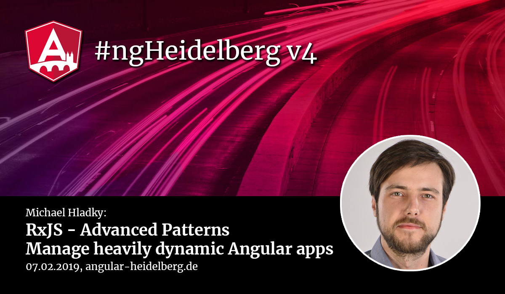

# #ngHeidelberg v4
_with Michael Hladky_

## RxJS - Advanced Patterns: Learn how to manage heavily dynamic Angular apps

Angular is build on top of RxJS. All asynchronous tasks are implemented with observables. Therefore it is immensely important to master this toolset. Let's explore advanced techniques with RxJS! In a livecoding session we will learn:
* how to implement the basics of CQRS
* orchestrate rendering and UI interaction
* dynamically compose event patterns
* optimise performance

This talk has an advanced level, but we will make sure that also beginners are not left behind.

## ABOUT MICHAEL HLADKY

Michael is located in Austria Vienna. He is a certified Google Developer Expert (GDE), trainer developer and consultant in the field of Angular, RxJS and Ionic. As an active community member, he is the organiser of Angular Vienna and founder and leading head of Angular Austria, a non-profit association to support Angular.

📹 Video: https://youtu.be/ZaUxIX_Q0R4  
💻 [Slides](http://bit.ly/slides-ngHeidelbergv4)  
💻 [Slides Backup](slides-rxjs.pdf)   
💻 [Code](https://stackblitz.com/edit/rxjs-operating-heavily-dynamic-uis)  
