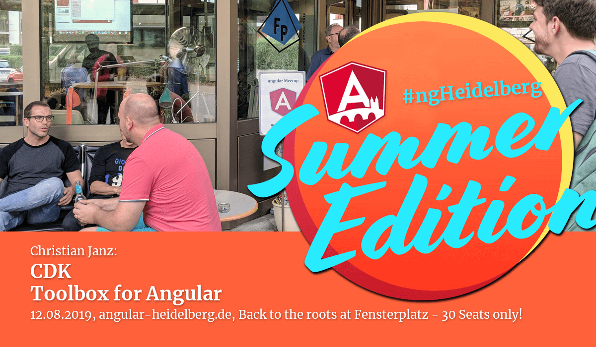

# #ngHeidelberg v7
_with Christian Janz_

## CDK – Toolbox for Angular

When developing enterprise apps with Angular, we need a rich set of UI components in order to be fast and efficient. But what happens if there is no ready-made component for a use case available? The "Component Dev Kit" (CDK) comes to the rescue. It simplifies the development of wizards, popups, drag & drop and other component behaviors.

In this talk, Christian will give an overview of the CDK followed by some live coding.

## ABOUT CHRISTIAN JANZ

Christian Janz works as a Senior Software Architect in the Product Development unit at oxaion GmbH in Ettlingen. He is particularly interested in the architecture and development of business applications using modern JavaScript and Java frameworks. Christian studied computer science at the University of Karlsruhe and has more than 10 years of experience in professional software development. He regularly shares his experiences from the various projects at conferences and meetups.

📹 Video: https://youtu.be/cwlebpxtXB0 .   
💻 [Slides](slides-angular-cdk.pdf)  
💻 [Code](https://github.com/cjanz/cdk-samples)  
