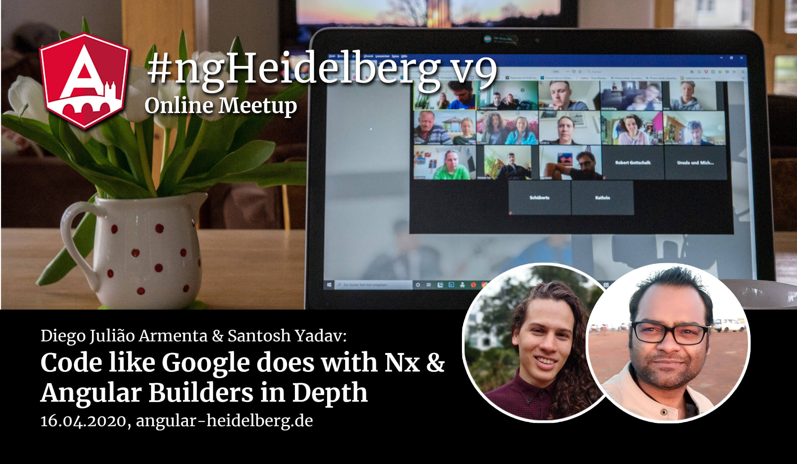

# #ngHeidelberg v9
_with Diego Julião Armenta & Santosh Yadav_

## Diego Julião Armenta: Code like Google does with Nx

One of the biggest challenges of building a full-stack web application is managing complexity; if you're building a serious product, you likely have multiple front-end applications that communicate with a back-end that share interfaces with multiple team members that need to collaborate efficiently.

Nx is a tool that can dramatically simplify the way you organize tests and share code between multiple JavaScript applications.

The tool itself is based on the best practices developed at Google to scale thousands of applications across thousands of developers in a single mono repo, but you don't need to be operating at Google scale to see the benefits of NX, it can be a very powerful tool for projects of all sizes and not just angular but full stack javascript.

The talk will be held in English.

## ABOUT DIEGO JULIÃO ARMENTA

Diego Julião Armenta is a Software Engineer with 5+ years of professional experience focused on JavaScript technologies, passionate and committed with the quality of his work. Working with Angular since version 2 and with widely experience with its ecosystem, NativeScript, NestJS, Nx and create/publish libraries for the framework.

📹 Video: TODO  
💻 [Slides](TODO)  
💻 [Code](TODO)

-----

## Santosh Yadav: Angular Builders in Depth

Angular made the Angular CLI builders API public – in this talk we will explore why it was required and how to use it. We will learn how to create our own builder and make complicated things easier for us. We will explore the API in depth and learn a lot about how the CLI works internally. Of course, I will also show you the most popular builders that will make your daily work easier and showcase you a some of the lesser-known gems that might be added to the Angular CLI as a command in the future.

The talk will be held in English.

## ABOUT SANTOSH YADAV

Santosh is a GDE for Angular and web Technologies and an active contributor to Angular and NgRx. He writes for AngularInDepth and mentors at Dotnettricks and Orgnizer of Pune Tech Meetup. He is the creator of the `ng deploy` package for Netlify and part of NestJSAddons core team.

📹 Video: TODO  
💻 [Slides](TODO)  
💻 [Code](TODO)
